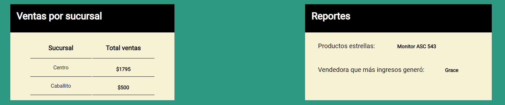
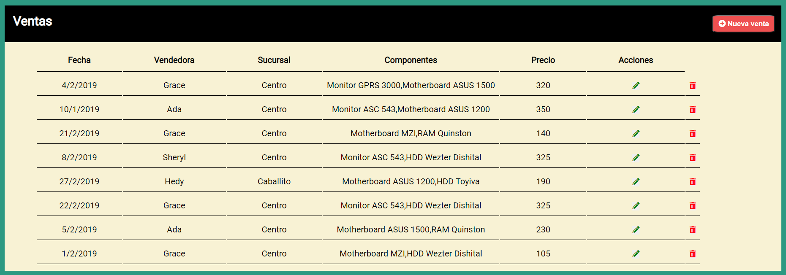
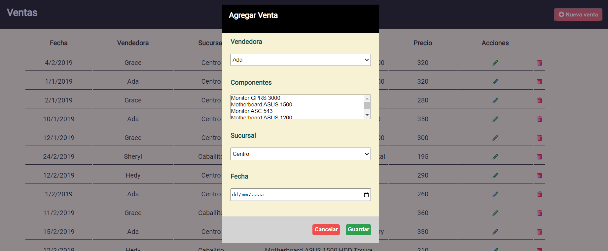
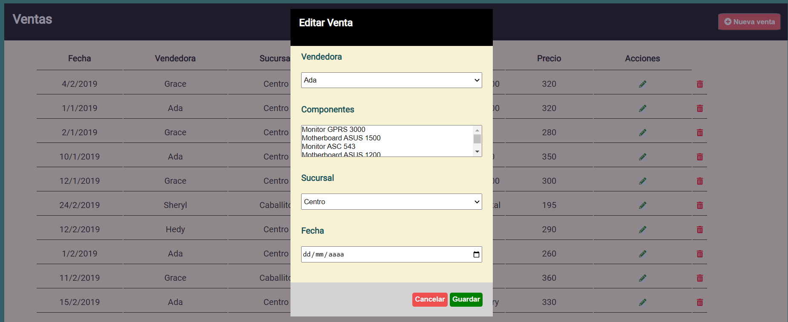
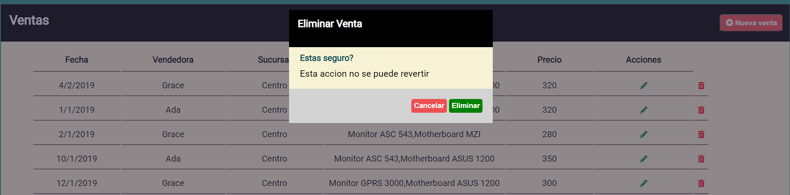
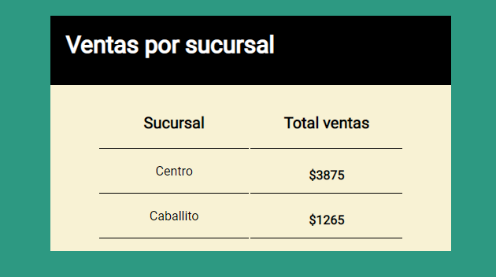
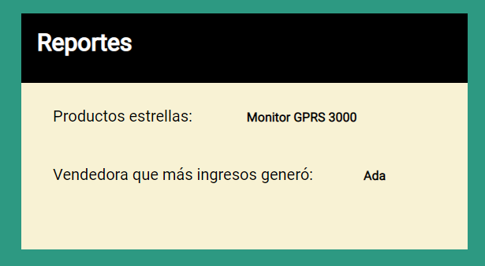

# PROYECTO CAJERO ADA

El siguiente trabajo fue realizado como practica para el curso de Front end en ADA ITW. 

Consiste en emulador de un cajero en el que se puede agregar diversas funcionalidades.Se divide en 3 partes. 

## Realizado con:

1. HTML 
* tablas
* contenedores

2. CSS
* Tipografia
* Responsive

3. JAVASCRIPT
* Variables
* Manejo de DOM
* Funciones
* Arrays
* OBjetos de array
* Modificacion de fechas

### Son dos contenedores en la parte superior y uno en la parte inferior. 

###  Parte superior: Se divide en ventas por sucursal y reportes 

###  Parte Inferior: Contiene la tabla que tiene las ventas

## Funcionalidades 

1. Agregar nueva venta 
2. Editar venta 
3. Eliminar venta 
4. Actualizar ventas por sucursal  
5. Actualizar reportes

## 1-Agregar venta  

## 1-Agregar venta  
Agrega una venta nueva permitiendo agregar todos los datos de la modal.

## 2-Editar venta
 Permite editar las ventas de la tabla modificando los datos de la modal.

## 3-Eliminar venta
Permite eliminar la venta seleccionada.

## 4-Actualizar ventas por sucursal 

## 5-Actualizar reportes

